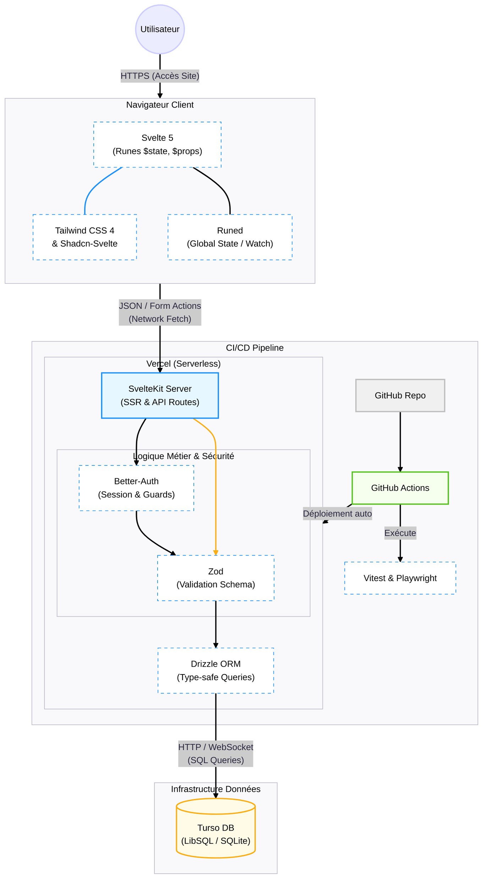

# Diagramme d'architecture

```mermaid
---
config:
  layout: dagre
  theme: redux
---
flowchart TB
 subgraph DevOps["CI/CD Pipeline"]
        GitHub["GitHub Repo"]
        Actions["GitHub Actions"]
        Tests["Vitest & Playwright"]
        Vercel["Vercel"]
  end
 subgraph Browser["Navigateur Client"]
    direction TB
        UI["Svelte 5
        (Runes $state, $props)"]
        Tailwind["Tailwind CSS 4
        & Shadcn-Svelte"]
        Runed["Runed
        (Global State / Watch)"]
  end
 subgraph Logic["Logique Métier & Sécurité"]
        Zod["Zod
            (Validation Schema)"]
        Auth["Better-Auth
            (Session & Guards)"]
  end
 subgraph Vercel["Vercel (Serverless)"]
    direction TB
        SvelteServer["SvelteKit Server
        (SSR & API Routes)"]
        Logic
        ORM["Drizzle ORM
        (Type-safe Queries)"]
  end
 subgraph Infra["Infrastructure Données"]
        Turso[("Turso DB
        (LibSQL / SQLite)")]
  end
    GitHub --> Actions
    Actions -- Exécute --> Tests
    Actions -- Déploiement auto --> Vercel
    UI --- Tailwind & Runed
    SvelteServer --> Auth
    Auth --> Zod
    SvelteServer --> Zod
    Zod --> ORM
    User(("Utilisateur")) -- HTTPS (Accès Site) --> Browser
    Browser -- JSON / Form Actions
    (Network Fetch) --> SvelteServer
    ORM -- HTTP / WebSocket
    (SQL Queries) --> Turso

     GitHub:::ext
     Actions:::ci
     Tests:::component
     UI:::component
     Tailwind:::component
     Runed:::component
     Zod:::component
     Auth:::component
     SvelteServer:::container
     ORM:::component
     Turso:::db
     User:::actor
    classDef actor fill:#ececff,stroke:#ccccff,stroke-width:2px,color:black
    classDef container fill:#e6f7ff,stroke:#1890ff,stroke-width:2px,color:black
    classDef component fill:#ffffff,stroke:#1890ff,stroke-width:1px,stroke-dasharray: 5 5,color:black
    classDef db fill:#fffbe6,stroke:#faad14,stroke-width:2px,color:black
    classDef ext fill:#f0f0f0,stroke:#bdbdbd,stroke-width:2px,color:black
    classDef ci fill:#f6ffed,stroke:#52c41a,stroke-width:2px,color:black
    linkStyle 3 stroke:#1890ff,stroke-width:2px,fill:none
    linkStyle 7 stroke:#faad14,stroke-width:2px,fill:none
```
