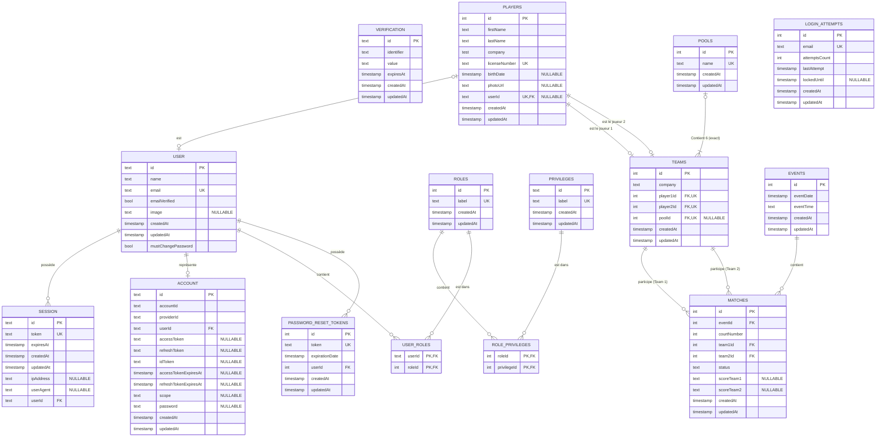

# Modèle Physique de Données

## Modèle de données généré par BetterAuth

```mermaid
erDiagram

    USER ||--o{ SESSION : possède
    USER ||--o| ACCOUNT : représente


    USER {
        text id PK
        text name
        text email UK
        bool emailVerified
        text image "NULLABLE"
        timestamp createdAt
        timestamp updatedAt
        bool mustChangePassword
    }

    SESSION {
        text id PK
        text token UK
        timestamp expiresAt
        timestamp createdAt
        timestamp updatedAt
        text ipAddress "NULLABLE"
        text userAgent "NULLABLE"
        text userId FK
    }

    ACCOUNT {
        text id PK
        text accountId
        text providerId
        text userId FK
        text accessToken "NULLABLE"
        text refreshToken "NULLABLE"
        text idToken "NULLABLE"
        timestamp accessTokenExpiresAt "NULLABLE"
        timestamp refreshTokenExpiresAt "NULLABLE"
        text scope "NULLABLE"
        text password "NULLABLE"
        timestamp createdAt
        timestamp updatedAt
    }

    VERIFICATION {
        text id PK
        text identifier
        text value
        timestamp expiresAt
        timestamp createdAt
        timestamp updatedAt
    }

    ROLES ||--o{ ROLE_PRIVILEGES : "contient"
    PRIVILEGES ||--o{ ROLE_PRIVILEGES : "est dans"
    USER ||--o{ USER_ROLES : "contient"
    ROLES ||--o{ USER_ROLES : "est dans"
    PLAYERS |o--o| USER : "est"

    PRIVILEGES {
        text id PK
        text label UK
        timestamp createdAt
        timestamp updatedAt
    }

    ROLES {
        int id PK
        text label UK
        timestamp createdAt
        timestamp updatedAt
    }

    ROLE_PRIVILEGES {
        int roleId PK,FK
        int privilegeId PK,FK
    }

    USER_ROLES {
        text userId PK,FK
        int roleId PK,FK
    }

    PLAYERS {
        int id PK
        text firstName
        text lastName
        test company
        text licenseNumber UK
        timestamp birthDate "NULLABLE"
        text photoUrl "NULLABLE"
        text userId UK,FK "NULLABLE"
        timestamp createdAt
        timestamp updatedAt
    }

    POOLS {
        int id PK
        text name UK
        timestamp createdAt
        timestamp updatedAt
    }

    PLAYERS ||--o| TEAMS : "est le joueur 1"
    PLAYERS ||--o| TEAMS : "est le joueur 2"
    POOLS |o--|{ TEAMS : "Contient 6 (exact)"

    TEAMS {
        int id PK
        text company
        int player1Id FK,UK
        int player2Id FK,UK
        int poolId FK,UK "NULLABLE"
        timestamp createdAt
        timestamp updatedAt
    }

    EVENTS {
        int id PK
        timestamp eventDate
        text eventTime
        timestamp createdAt
        timestamp updatedAt
    }

    EVENTS ||--o{ MATCHES : "contient"
    TEAMS ||--o{ MATCHES : "participe (Team 1)"
    TEAMS ||--o{ MATCHES : "participe (Team 2)"

    MATCHES {
        int id PK
        int eventId FK
        int courtNumber
        int team1Id FK
        int team2Id FK
        text status
        text scoreTeam1 "NULLABLE"
        text scoreTeam2 "NULLABLE"
        timestamp createdAt
        timestamp updatedAt
    }

    USER ||--o{ PASSWORD_RESET_TOKENS : "possède"

    PASSWORD_RESET_TOKENS {
        int id PK
        text token UK
        timestamp expirationDate
        int userId FK
        timestamp createdAt
        timestamp updatedAt
    }

    LOGIN_ATTEMPTS {
        int id PK
        text email UK
        int attemptsCount
        timestamp lastAttempt
        timestamp lockedUntil "NULLABLE"
        timestamp createdAt
        timestamp updatedAt
    }
```
